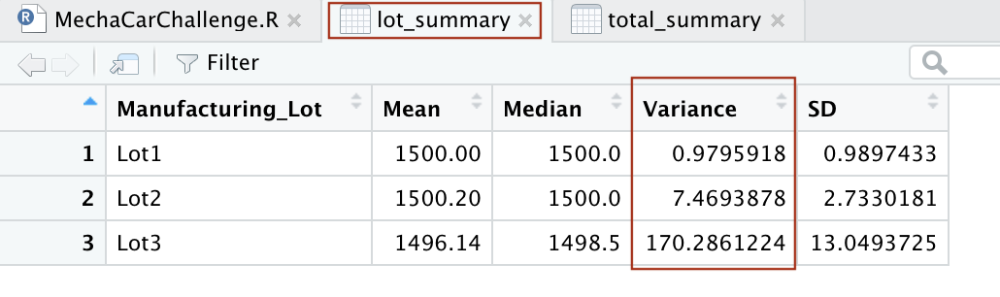

# MechaCar Statistical Analysis

## Linear Regression to Predict MPG

The multiple linear regression model determines if there is a significant relationship between the mpg and the vehicle length, vehicle weight, spoiler angle, ground clearance, and drivetrain of the 50 MechaCar prototypes. 

*To determine which variables/coefficients contribute a non-random amount of variance to the mpg values in the dataset, we evaluate the p-value which is the `Pr(|t|)` value in the summary output. Assuming a significance level of 0.05, variables with p-values that are less than 0.05 indicate sufficient evidence that our null hypothesis is not true and the relationship between the variables is statistically likely to provide non-random amounts of variance. Vehicle length (p-value of 2.60e-12) and ground clearance (p-value of 5.21e-08) have a significant impact on mpg of MechaCar prototypes. 

*The slope of the linear model would not be considered to be zero. The p-value of the entire multiple linear regression is 5.35e-11 which is below the significance level of 0.05. This means we can reject the null hypothesis that says the slope of the linear model is zero, m = 0. Therefore, the slope is not equal to zero. 

*The r-squared value of 0.71 and a signifiant p-value of 5.35e-11 indicate that linear model effectively predicts mpg of MechaCar prototypes. However, we only found that two of the five variables were significant contributors to mpg. This would indicate potential of overfitting. While our model works well for the purposes of this dataset, it may not be a good predictive model for future data. 

## Summary Statistics on Suspension Coils

As seen in the `total_summary` table, the variance for all manufacturing lots is 62.29 PSI which meets the design specifications for the MechaCar suspension coils. 

The `lot_summary` table shows the variance of suspension coils for each manufacturing lot. Lot 1 and Lot 2 meet the design specifications with variances of 0.98 and 7.47 PSI, respectively. Lot 3 does not meet design specifications because the variance of suspension coils is 170.29 PSI which exceeds the 100 PSI limit. 

## T-Tests on Suspension Coils
Four t-tests were performed to evaluate whether the PSI of suspension coils for all manufacturing lots and each individual lot is statistically different from the population mean of 1,500 PSI.

The t-test of the PSI across all manufacturing lots and the population mean of 1,500 PSI resulted in a p-value of 0.06, which is above the significance value of 0.05. Based on this, there is not sufficient evidence to reject the null hypothesis and therefore we can conclude there is no statistical difference between the two samples. 

The t-test of the PSI of Lot 1 and population mean of 1,500 PSI resulted in a p-value of 1. Since the p-value is above the significance value of 0.05, there is not sufficient evidence to reject the null hypothesis. We can conclude there is no statistical difference between the two samples. In fact, a p-value of 1 indicates that the mean values of the two groups are the same. The `lot_summary` table in Deliverable 2 shows the mean of Lot 2 is 1,500 PSI. 

The t-test of the PSI of Lot 2 and population mean of 1,500 PSI resulted in a p-value of 0.61 PSI, which is above the significance value of 0.05 There is not sufficient evidence to reject the null hypothesis and conclude that there is no statistical difference between the two groups. 

The t-test of the PSI of Lot 3 and the population mean of 1,500 PSI resulted in a p-value of 0.04 which is below the significance level of 0.05. This indicates that there is sufficient evidence to reject the null hypothesis and we can state that there is a statistical difference between the two groups. 

## Study Design: MechaCar vs Competition
A potential area of interest for consumers that MechaCar should explore in their cars' performance against the competition is safety issues. Two safety issues that we can test are recalls and complaints of MechaCar models compared to competitors. The NHTSA tracks recalls and complaints for all makes and models. 

The null hypothesis: There is no statistical difference between the observed sample mean and its presumed population mean. 

We can perform a t-test to determine whether the amount of recalls and complaints for MechaCar's cars are statistically different than the leading competitors. A t-test will allow us to compare the mean number of recalls and complaints for MechaCar's cars and determine if there is a statistical difference compared to other companies on the market. Consumers can use this information as a gauge of how many issues they may expect when purchasing a car from MechaCar versus a competitor. 

The NHTSA tracks recalls and complaints for all car brands, makes, and models. We can use this information to find the amount of recalls and complaints for MechaCars and the same for the leading competitor brands of MechaCar. Then we could use this data to perform a t-test using R. 
